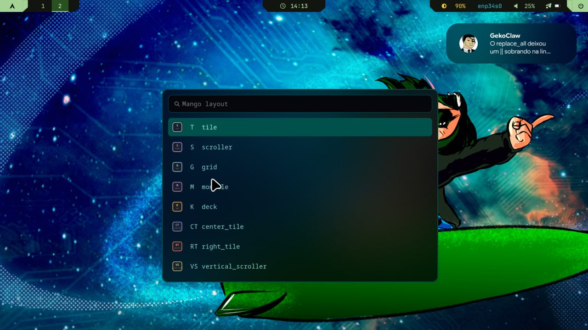

<div align="center">

# 🪐 Indecisius Dotfiles

**MangoWM-focused desktop rice for CachyOS**

*Powered by Waybar · Wofi · Cava · matugen · nwg-look*


<br>


</div>

---

## 📑 Table of Contents

- [About](#-about)
- [Stack](#-stack)
- [Screenshots](#-screenshots)
- [Structure](#-structure)
- [Keybinds](#-keybinds)
- [Launcher](#-launcher)
- [Appearance](#-appearance)
- [Installation](#-installation)
- [Dependencies](#-dependencies)
- [Notes](#-notes)
- [Credits & Inspirations](#-credits--inspirations)

---

## 💡 About

This repository stores my Wayland desktop configuration for **CachyOS**, built around **MangoWM** as the primary compositor. The setup is designed to be:

- **Modular** — configs are split into small, purpose-specific files
- **Reproducible** — a safe installer handles backups, dependencies, and session setup
- **Color-aware** — wallpaper colors cascade to the bar, launcher, visualizer, and shell

The workflow avoids old-school launchers and panels, centralizing the visual stack around three core tools:

| Tool | Role |
|---|---|
| **matugen** | Extracts colors from the wallpaper and writes them to every themed config |
| **nwg-look** | Single-pane control for GTK theme, fonts, and cursors across toolkits |
| **Wofi** | Spotlight-style launcher with fuzzy search and helper menus |

---

## 🧰 Stack

| Component | Tool |
|---|---|
| **WM** | [MangoWM](https://github.com/CachyOS/mangowm) |
| **Bar** | [Waybar](https://github.com/Alexays/Waybar) — MangoWC theme + powerline SVGs |
| **Launcher** | [Wofi](https://hg.sr.ht/~scoopta/wofi) — spotlight + helper menus |
| **Dynamic colors** | [matugen](https://github.com/InioX/matugen) |
| **Audio visualizer** | [Cava](https://github.com/karlstav/cava) — matugen-driven colors |
| **GTK / cursor / fonts** | [nwg-look](https://github.com/nwg-piotr/nwg-look) — GTK 2/3/4, Qt5/6, XCursor |
| **Notifications** | [Mako](https://github.com/emersion/mako) |
| **Terminal** | [Kitty](https://sw.kovidgoyal.net/kitty/) |
| **Shell** | [Fish](https://fishshell.com/) + [Starship](https://starship.rs/) |
| **Clipboard** | [cliphist](https://github.com/sentriz/cliphist) + Wofi |
| **Wallpaper** | [awww](https://codeberg.org/LGFae/awww) + [waypaper](https://github.com/anufrievroman/waypaper) |
| **Screenshots** | [grim](https://sr.ht/~emersion/grim/) + [slurp](https://github.com/emersion/slurp) + [swappy](https://github.com/jtheoof/swappy) |
| **Power menu** | [wlogout](https://github.com/ArtsyMacaw/wlogout) |

---

## 📸 Screenshots

> Click each image to see the full-size capture.

### Desktop & Layouts

| | |
|:---:|:---:|
| **Default tiling** | **Center-tile layout** |
|  |  |
| **Grid layout** | **Tile master layout** |
|  | %20layout.png) |

**Scroller layout**


### Apps & Bar

| | |
|:---:|:---:|
| **Wofi spotlight** — `SUPER + D` | **Layout menu** — `SUPER + N` |
| .png) |  |

**Waybar + Cava** — top bar with powerline SVGs, workspace switcher, and terminal audio visualizer driven by matugen wallpaper colors


---

## 📂 Structure

```text
.
├── .config/
│   ├── mango/
│   │   ├── config.conf              # main entrypoint — sources all modules
│   │   ├── configs/                 # core: env, execs, layout, colors, keybinds…
│   │   ├── custom/                  # personal overrides (loaded last)
│   │   ├── scripts/                 # reload, wallpaper, matugen, nwg-look, menus
│   │   ├── monitors.conf            # active monitor layout
│   │   └── mango.desktop            # session entry for display managers
│   ├── waybar/
│   │   ├── MangoWC/                 # config, CSS, matugen.css, powerline SVGs
│   │   └── Modules/                 # split Waybar modules
│   ├── wofi/                        # spotlight, layout menu, and Wofi styles
│   ├── cava/                        # audio visualizer with matugen-generated colors
│   ├── gtk-3.0/                     # GTK 3 settings (via nwg-look)
│   ├── gtk-4.0/                     # GTK 4 settings (synced by wrapper)
│   ├── qt5ct/ & qt6ct/              # Qt font/icon settings (mirrored from GTK)
│   ├── kitty/                       # terminal config
│   ├── fish/                        # shell config
│   ├── starship.toml                # Starship prompt
│   ├── mako/                        # notification daemon
│   ├── matugen/                     # matugen templates
│   ├── wlogout/                     # power menu
│   └── waypaper/                    # wallpaper GUI config
├── .icons/default/index.theme       # default XCursor theme pointer
├── .local/share/applications/       # local .desktop entries
├── screenshots/                     # gallery captures
└── install.sh                       # installer (dry-run by default)
```

---

## ⌨️ Keybinds

### Core

| Shortcut | Action |
|---|---|
| `SUPER + Return` | Open Kitty terminal |
| `SUPER + Q` | Close focused window |
| `SUPER + D` / `SUPER + Space` | Wofi spotlight (`drun`) |
| `SUPER + Shift + D` | Wofi run menu |
| `SUPER + R` | Reload MangoWM + Waybar |
| `SUPER + B` | Toggle / reload Waybar |

### Navigation & Workspaces

| Shortcut | Action |
|---|---|
| `SUPER + grave` / `Tab` / `O` | MangoWM overview |
| `SUPER + N` | Layout menu |
| `SUPER + comma` | Toggle scroller centering |
| `SUPER + 1..9` | Switch to workspace |
| `SUPER + Shift + 1..9` | Move window to workspace |

Scrolling over the Waybar workspace area also switches workspaces (up = previous, down = next).

### Utilities

| Shortcut | Action |
|---|---|
| `SUPER + V` | Clipboard history |
| `SUPER + Shift + .` | Emoji picker |
| `SUPER + W` | Random wallpaper + matugen update |
| `SUPER + Shift + W` | Open Waypaper |
| `SUPER + Shift + A` | Open nwg-look → auto-sync on close |
| `SUPER + Shift + S` | Area screenshot → clipboard |
| `SUPER + Shift + R` | Area screenshot → file |

---

## 🚀 Launcher

The main launcher is **Wofi** in `drun` mode:

```bash
wofi --show drun --conf ~/.config/wofi/spotlight.conf --no-actions
```

Key settings in `spotlight.conf`:

```ini
matching=fuzzy
insensitive=true
drun-ignore_metadata=true
```

This makes search fuzzy and case-insensitive, while preventing apps from being prioritized by description keywords. Searching for `files` will rank Nautilus/Files above editors that merely mention "edit text files".

---

## 🎨 Appearance

### matugen — Dynamic Wallpaper Colors

The script `update-matugen-accent.sh` extracts a palette from the current wallpaper and writes it to:

| Target | File |
|---|---|
| MangoWM accents | `configs/colors.matugen.conf` |
| Waybar CSS | `waybar/MangoWC/matugen.css` |
| Waybar powerline SVGs | `waybar/MangoWC/svg/` |
| Wofi CSS | `wofi/matugen.css` |
| Cava config | `cava/config` |
| Fish / Starship | Colors when applicable |

Wallpaper scripts call this update automatically — change the wallpaper with `SUPER + W` and the entire desktop theme updates in seconds.

### nwg-look — GTK / Cursor / Font Sync

The wrapper `nwg-look-sync.sh` opens nwg-look and, on close, propagates settings to:

- **GTK 3 / GTK 4 / GTK 2** — `settings.ini` and `gtkrc-2.0`
- **XCursor** — `~/.icons/default/index.theme`
- **MangoWM** — cursor size, theme, env vars
- **GSettings** — `org.gnome.desktop.interface`
- **Qt 5 / Qt 6** — fonts and icons via `qt5ct` / `qt6ct`

Launch it with `SUPER + Shift + A` or directly:

```bash
~/.config/mango/scripts/nwg-look-sync.sh --open
```

---

## 📦 Installation

> **Target**: CachyOS / Arch Linux with MangoWM

### Quick Start

```bash
git clone https://github.com/Guilherme4Colamarco/Indecisius-dotfiles.git
cd Indecisius-dotfiles
./install.sh              # dry-run — shows what would happen
```

### Apply Changes

```bash
./install.sh --apply                    # install configs only
./install.sh --apply --with-aur         # also install AUR packages
./install.sh --apply --with-aur --yes   # unattended (skip prompts)
```

### What the Installer Does

1. **Validates** the checkout contains the expected config directories
2. **Backs up** existing config paths to timestamped `.bak` directories
3. **Offers a system snapshot** if Snapper or Timeshift is detected
4. **Copies** configs to `~/.config/`, `~/.icons/`, and `~/.local/share/`
5. **Installs** the `mango.desktop` session to `~/.local/share/wayland-sessions/`
6. **Installs packages** via `pacman` (and optionally AUR helpers)

### Manual Installation

```bash
mkdir -p ~/.config ~/.icons ~/.local/share/applications
cp -r .config/. ~/.config/
cp -r .icons/. ~/.icons/
cp -r .local/share/applications/. ~/.local/share/applications/

# optional: register the Mango session for your display manager
mkdir -p ~/.local/share/wayland-sessions
cp ~/.config/mango/mango.desktop ~/.local/share/wayland-sessions/
```

---

## 📋 Dependencies

### Core

| Package | Purpose |
|---|---|
| `mangowm` | Window manager / compositor |
| `waybar` | Top bar |
| `wofi` | Launcher and helper menus |
| `matugen` + `jq` | Wallpaper-based dynamic colors |
| `cava` | Terminal audio visualizer |
| `nwg-look` | GTK theme, fonts, and cursor control |
| `qt5ct` + `qt6ct` | Qt appearance settings |
| `mako` | Notification daemon |

### Terminal & Shell

| Package | Purpose |
|---|---|
| `kitty` | Terminal emulator |
| `fish` + `starship` + `zoxide` | Shell, prompt, and smart `cd` |
| `bat` + `eza` + `yazi` + `neovim` | Fish aliases and terminal workflow |
| `fastfetch` | System summary |

### Utilities

| Package | Purpose |
|---|---|
| `cliphist` + `wl-clipboard` | Clipboard history |
| `grim` + `slurp` + `swappy` | Screenshots |
| `wlogout` | Power menu |
| `brightnessctl` | Screen brightness |
| `pavucontrol` + `pamixer` + `playerctl` | Audio and media controls |
| `networkmanager` + `bluetui` | Wi-Fi / Bluetooth helpers |
| `gnome-keyring` + `polkit` | Secrets and authentication |
| `xdg-desktop-portal` + `xdg-desktop-portal-wlr` | Wayland portals |

---

## 📝 Notes

- `config.conf` loads core modules first, then overrides from `custom/` — personal tweaks always win.
- Files generated by matugen and nwg-look are versioned as a snapshot of the current state. Change them through the tools, not by hand.
- Multiple monitor configs are included (`monitors.conf`, `monitors-duel-monitors.conf`, `monitors-1440p-triple-screens.conf`). Symlink or copy the one that fits your setup.
- The `backups/` directory is created at runtime and is not part of the main workflow.

---

## 🙏 Credits & Inspirations

- **[CachyOS](https://cachyos.org/)** community for the packages and MangoWM integration
- **[MangoWM](https://github.com/CachyOS/mangowm)** project for the compositor
- **[cybrcore/cybr-waybar](https://github.com/cybrcore/cybr-waybar)** by scherrer-txt — inspiration for the Waybar visual structure, angular separators, and custom module patterns
- **[cybrcore/cybr-fish](https://github.com/cybrcore/cybr-fish)** and **[cybrcore/cybr-starship](https://github.com/cybrcore/cybr-starship)** by scherrer-txt — inspiration / adaptation of the Fish color palette and Starship prompt
- [Waybar](https://github.com/Alexays/Waybar), [Wofi](https://hg.sr.ht/~scoopta/wofi), [Mako](https://github.com/emersion/mako), [matugen](https://github.com/InioX/matugen), and all the other free/open-source tools that make this setup possible

---

<div align="center">

*Made with 🧡 on CachyOS*

</div>
>
