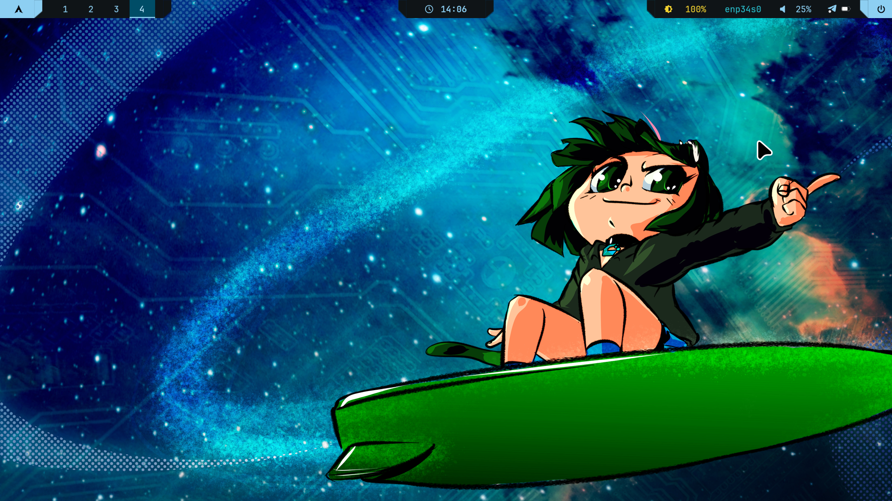
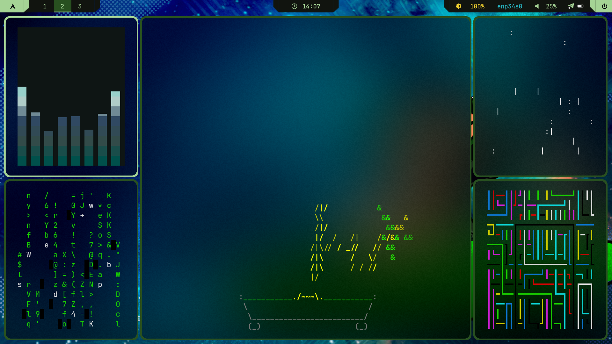
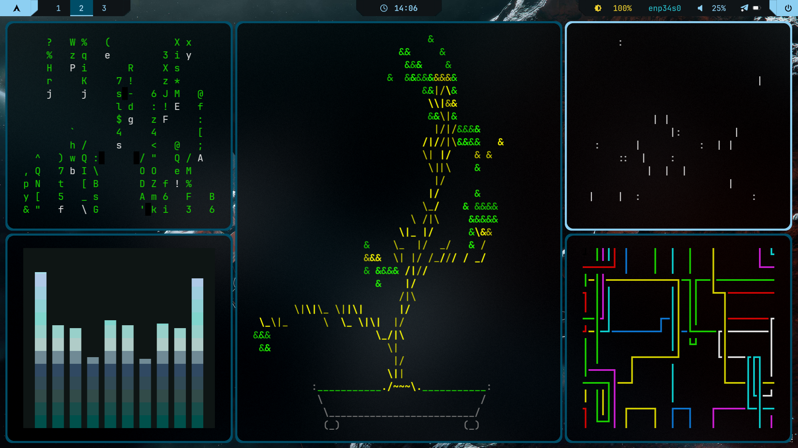
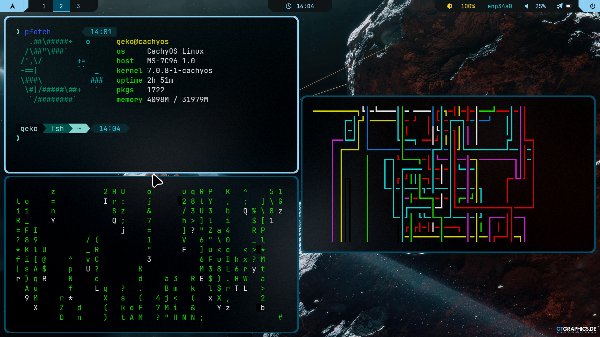
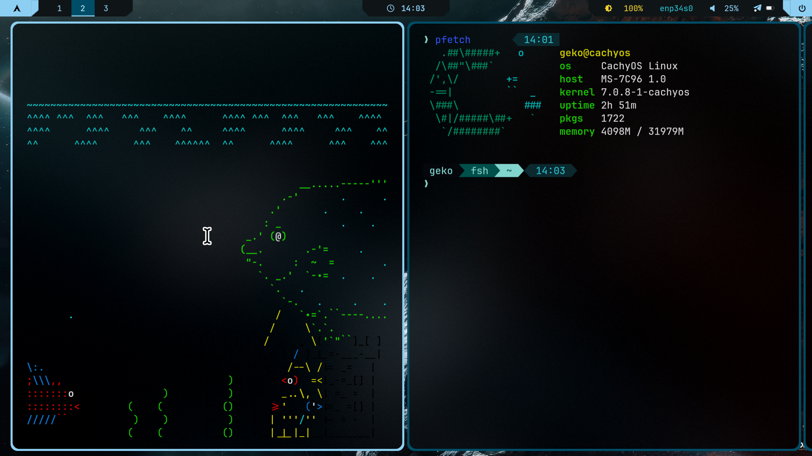

# Indecisius Dotfiles

> MangoWM-focused desktop rice for CachyOS, powered by Waybar, Wofi, Cava, matugen, and nwg-look-managed appearance settings.

## About

This repository stores my current Wayland desktop configuration for **CachyOS**, focused on **MangoWM** as the main compositor. The goal is to keep the setup modular, easy to restore, and simple to tweak day to day.

The current workflow avoids old launchers/panels and centralizes the visual setup around three tools:

- `matugen` for wallpaper-derived colors
- `nwg-look` for GTK theme, font, and cursor control
- `wofi` as the main spotlight-style launcher

## Stack

| Component | Tool |
|---|---|
| **WM** | [MangoWM](https://github.com/CachyOS/mangowm) |
| **Bar** | [Waybar](https://github.com/Alexays/Waybar) with the MangoWC theme + powerline SVGs |
| **Launcher** | [Wofi](https://hg.sr.ht/~scoopta/wofi) in `drun` spotlight mode |
| **Switcher/helper menus** | [Wofi](https://hg.sr.ht/~scoopta/wofi) in `dmenu` mode |
| **Dynamic colors** | [matugen](https://github.com/InioX/matugen) |
| **Audio visualizer** | [Cava](https://github.com/karlstav/cava) with matugen colors |
| **GTK/cursor/font appearance** | [nwg-look](https://github.com/nwg-piotr/nwg-look), GTK 2/3/4, Qt5/Qt6, and XCursor |
| **Notifications** | [Mako](https://github.com/emersion/mako) |
| **Terminal** | [Kitty](https://sw.kovidgoyal.net/kitty/) |
| **Shell** | [Fish](https://fishshell.com/) + Starship |
| **Clipboard** | [cliphist](https://github.com/sentriz/cliphist) + Wofi |
| **Wallpaper** | [awww](https://codeberg.org/LGFae/awww) + [waypaper](https://github.com/anufrievroman/waypaper) |
| **Screenshots** | [grim](https://sr.ht/~emersion/grim/) + [slurp](https://github.com/emersion/slurp) + [swappy](https://github.com/jtheoof/swappy) |
| **Power menu** | [wlogout](https://github.com/ArtsyMacaw/wlogout) |

## Structure

```text
.
├── .config/
│   ├── mango/
│   │   ├── config.conf              # main entrypoint, only orchestrates sources
│   │   ├── hyprmango/               # core modules: env, execs, layout, colors, keybinds
│   │   ├── custom/                  # personal overrides loaded last
│   │   └── scripts/                 # reload, wallpaper, matugen, nwg-look, menus
│   ├── waybar/
│   │   ├── MangoWC/                 # config, CSS, matugen.css, and powerline SVGs
│   │   └── Modules/                 # split Waybar modules
│   ├── wofi/                        # spotlight, layout menu, and Wofi styles
│   ├── cava/                        # audio visualizer with matugen-generated colors
│   ├── gtk-3.0/                     # settings exported by nwg-look
│   ├── gtk-4.0/                     # settings synced by the nwg-look wrapper
│   ├── qt5ct/                       # font/icons mirrored from nwg-look
│   ├── qt6ct/                       # font/icons mirrored from nwg-look
│   ├── kitty/                       # terminal
│   ├── fish/                        # shell and prompt
│   ├── mako/                        # notifications
│   ├── wlogout/                     # power menu
│   └── waypaper/                    # wallpaper GUI
├── .icons/default/index.theme       # default XCursor theme
├── .local/share/applications/       # local desktop entries, including synced nwg-look launcher
└── install.sh                       # installer; dry-run by default
```

## Main Keybinds

| Shortcut | Action |
|---|---|
| `SUPER + D` | Open Wofi spotlight (`drun`) |
| `SUPER + Space` | Open Wofi spotlight (`drun`) |
| `SUPER + grave` | Mango overview |
| `SUPER + Shift + D` | Wofi run menu |
| `SUPER + Return` | Kitty |
| `SUPER + Q` | Close focused window |
| `SUPER + V` | Clipboard history |
| `SUPER + Shift + .` | Emoji picker |
| `SUPER + Shift + A` | Open `nwg-look` and sync GTK/cursor/fonts on close |
| `SUPER + R` | Reload Mango and Waybar |
| `SUPER + B` | Toggle/reload Waybar |
| `SUPER + Tab` | Mango overview |
| `SUPER + O` | Mango overview |
| `SUPER + N` | Layout menu |
| `SUPER + comma` | Toggle scroller centering |
| `SUPER + W` | Random wallpaper + matugen update |
| `SUPER + Shift + W` | Open Waypaper |
| `SUPER + Shift + S` | Area screenshot to clipboard |
| `SUPER + Shift + R` | Area screenshot to file |
| `SUPER + 1..9` | Switch to tag/workspace |
| `SUPER + Shift + 1..9` | Move window to tag/workspace |

On Waybar, scrolling over the workspace area also switches tag/workspace:

- Scroll up: previous workspace
- Scroll down: next workspace

## Launcher

The main launcher is Wofi in `drun` mode:

```bash
wofi --show drun --conf ~/.config/wofi/spotlight.conf --no-actions
```

`~/.config/wofi/spotlight.conf` uses:

```ini
matching=fuzzy
insensitive=true
drun-ignore_metadata=true
```

This makes search fuzzy and case-insensitive, while avoiding apps being prioritized only because their description mentions the search term. Example: searching for `files` should prioritize Nautilus/Files, not editors that merely say “edit text files”.

The old launchpad was removed.

## Appearance

### Matugen

`~/.config/mango/scripts/update-matugen-accent.sh` extracts colors from the current wallpaper and updates:

- `~/.config/mango/hyprmango/colors.matugen.conf`
- `~/.config/waybar/MangoWC/matugen.css`
- Waybar powerline SVGs in `~/.config/waybar/MangoWC/svg/`
- `~/.config/wofi/matugen.css`
- `~/.config/cava/config`
- Fish/Starship colors when applicable

Wallpaper scripts call this update automatically.

### nwg-look

The wrapper `~/.config/mango/scripts/nwg-look-sync.sh` makes GTK theme, cursor, and fonts easier to control through `nwg-look`.

Recommended flow:

```bash
~/.config/mango/scripts/nwg-look-sync.sh --open
```

Or use the keybind:

```text
SUPER + Shift + A
```

When `nwg-look` closes, the wrapper syncs:

- GTK 3: `~/.config/gtk-3.0/settings.ini`
- GTK 4: `~/.config/gtk-4.0/settings.ini`
- GTK 2: `~/.config/gtkrc-2.0`
- XCursor: `~/.icons/default/index.theme`
- Mango: `~/.config/mango/custom/nwg-look-env.conf` and `nwg-look-mango.conf`
- GSettings: `org.gnome.desktop.interface`
- Qt: fonts and icons in `qt5ct` and `qt6ct`

## Screenshots

| Screenshot | Description |
|---|---|
|  | Desktop (default tiling, default tagging) |
| .png) | Wofi `drun` spotlight launcher |
|  | Waybar + Cava visualizer with matugen colors |
|  | Center-tile layout |
|  | Grid layout |
|  | Scroller layout |
|  layout.png) | Tile master layout |

## Installation

The installer is made for CachyOS/Arch Linux and runs in safe mode by default.

```bash
git clone <repo-url> Indecisius-dotfiles
cd Indecisius-dotfiles
./install.sh
```

The command above is a dry-run: it prints packages, backups, and copy operations without touching the system.

To actually apply changes:

```bash
./install.sh --apply
```

To allow AUR package installation/bootstrap:

```bash
./install.sh --apply --with-aur
```

For unattended installs after reviewing the dry-run:

```bash
./install.sh --apply --with-aur --yes
```

Existing config paths are moved to timestamped `.bak` backups before new files are copied. If Snapper or Timeshift is detected, the installer also offers to create a system snapshot before copying configs or installing packages.

The installer validates that the checkout contains the expected Mango/Waybar/Wofi config directories and installs the local `mango.desktop` session entry to `~/.local/share/wayland-sessions/` when present.

## Manual Installation

```bash
mkdir -p ~/.config ~/.icons ~/.local/share/applications
cp -r .config/. ~/.config/
cp -r .icons/. ~/.icons/
cp -r .local/share/applications/. ~/.local/share/applications/
```

Then install the local Mango session if you want to ensure your display manager uses this config tree:

```bash
mkdir -p ~/.local/share/wayland-sessions
cp ~/.config/mango/mango.desktop ~/.local/share/wayland-sessions/
```

## Dependencies

| Package | Purpose |
|---|---|
| `mangowm` | Window manager |
| `waybar` | Top bar |
| `wofi` | Main launcher |
| `wofi` | Launcher and helper menus |
| `matugen` + `jq` | Wallpaper-based dynamic colors |
| `cava` | Terminal audio visualizer |
| `nwg-look` | GTK theme, fonts, and cursor |
| `qt5ct` + `qt6ct` | Appearance settings for Qt apps |
| `mako` | Notifications |
| `kitty` | Terminal |
| `fish` + `starship` + `zoxide` | Shell |
| `bat` + `eza` + `yazi` + `neovim` | Fish aliases and terminal workflow |
| `fastfetch` | Terminal system summary |
| `networkmanager` + `bluetui` | Fish Wi-Fi/Bluetooth helper aliases |
| `pavucontrol` + `pamixer` + `playerctl` | Audio and media controls |
| `nwg-look` | GTK theme, fonts, and cursor |
| `qt5ct` + `qt6ct` | Appearance settings for Qt apps |
| `awww` | Wallpaper daemon |
| `waypaper` | Wallpaper GUI |
| `cliphist` + `wl-clipboard` | Clipboard history and integration |
| `grim` + `slurp` + `swappy` | Screenshots |
| `wlogout` | Power menu |
| `brightnessctl` | Screen brightness |
| `gnome-keyring` + `polkit` | Secrets and authentication |
| `xdg-desktop-portal` + `xdg-desktop-portal-wlr` | Wayland portals |

## Notes

- `~/.config/mango/config.conf` loads core modules first, then overrides from `~/.config/mango/custom/`.
- Files generated by matugen/nwg-look are versioned here as a reference for the current state, but they should be changed through the tools, not manually.
- `~/.config/mango/backups/` is not part of the main workflow.

## Credits

- CachyOS community for the packages and MangoWM integration
- MangoWM project for the compositor
- Waybar, Wofi, Mako, matugen, and the other free tools used in this setup
